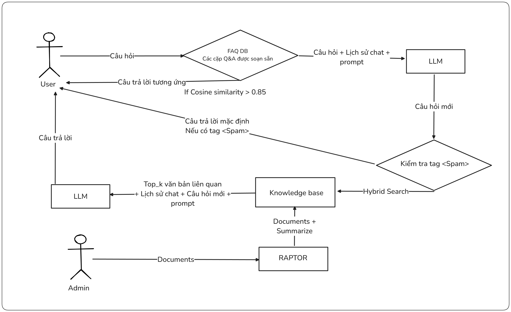
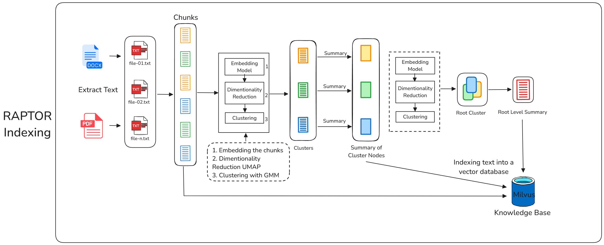
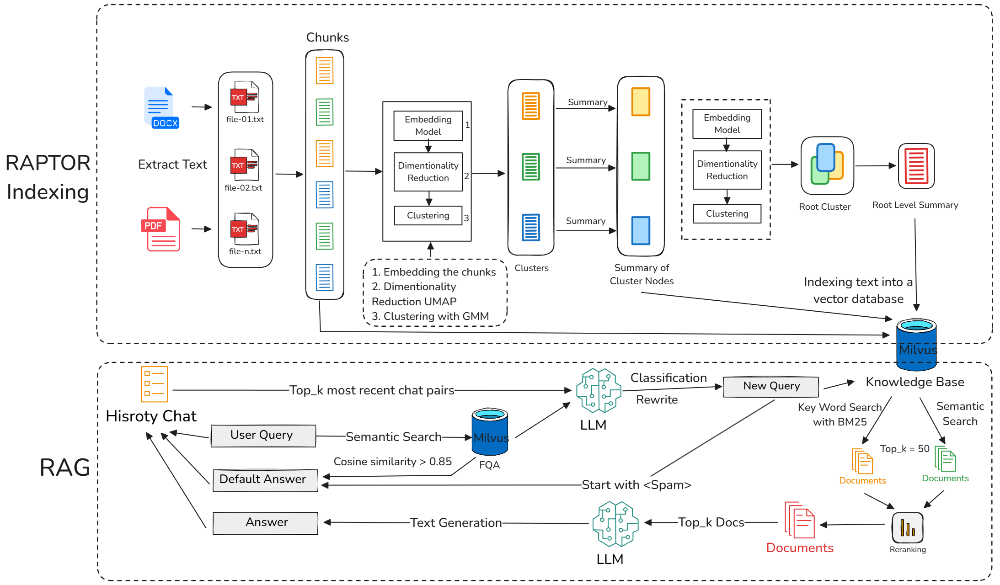
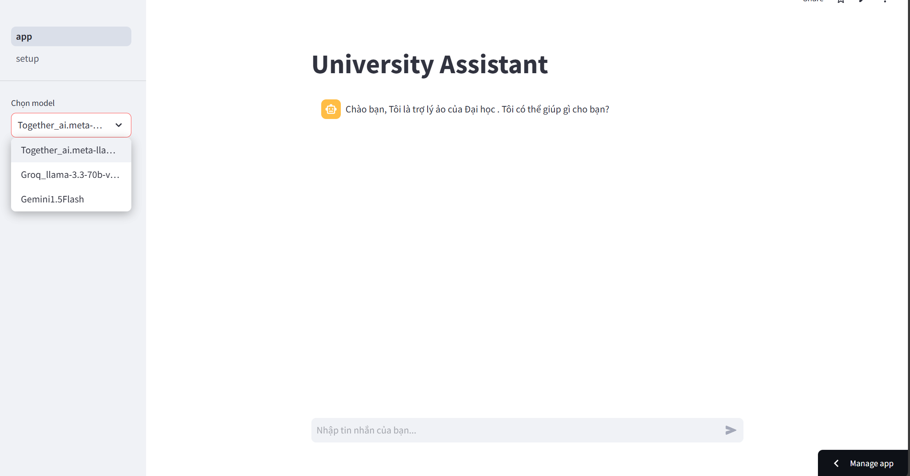
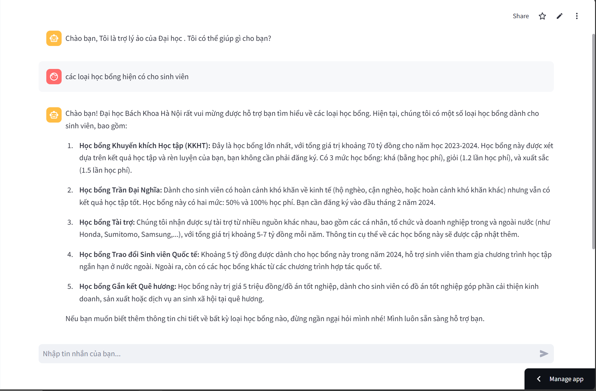
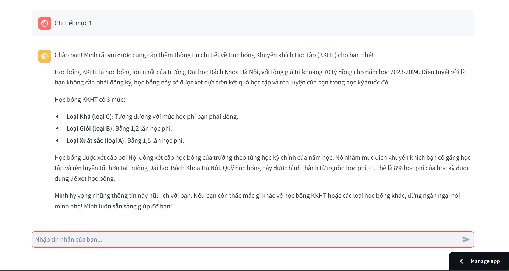
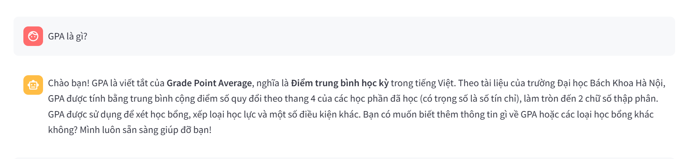
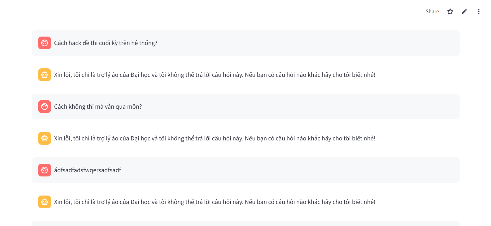
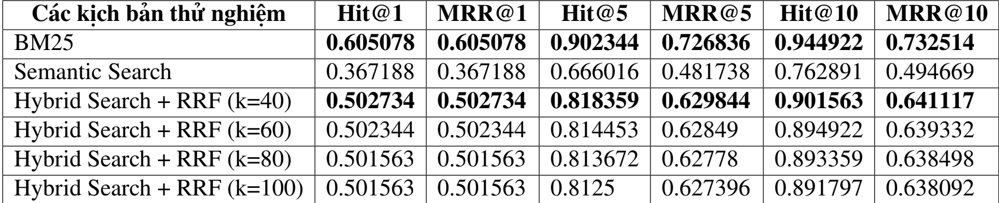

---

# Chatbot Tư vấn Sinh viên đại học với RAPTOR-RAG

**Mô tả ngắn gọn**: Dự án này xây dựng một hệ thống chatbot thông minh sử dụng kỹ thuật Retrieval-Augmented Generation (RAG) cải tiến với phương pháp RAPTOR để tư vấn và hỗ trợ sinh viên Đại học ABC. Chatbot giúp trả lời các câu hỏi thường gặp, cung cấp thông tin chính xác và giảm tải công việc cho bộ phận hỗ trợ sinh viên.

---

## Mục tiêu của dự án

- **Hỗ trợ tự động**: Cung cấp công cụ tư vấn tự động cho sinh viên về các vấn đề học tập, quy định trường học và các câu hỏi thường gặp.
- **Giảm tải công việc**: Hỗ trợ bộ phận tư vấn sinh viên, cho phép giảng viên và nhân viên tập trung vào các nhiệm vụ chuyên môn cao hơn.
- **Nâng cao chất lượng**: Sử dụng các kỹ thuật RAG tiên tiến (kết hợp RAPTOR) để đảm bảo câu trả lời chính xác, cập nhật và phù hợp với ngữ cảnh.

---

## Công nghệ và phương pháp sử dụng

### Retrieval-Augmented Generation (RAG)
RAG là kỹ thuật kết hợp mô hình ngôn ngữ lớn (LLM) với tri thức bên ngoài bằng cách truy xuất thông tin từ kho tài liệu riêng. Điều này giúp:
- Cập nhật thông tin liên tục mà không cần huấn luyện lại LLM.
- Sử dụng nguồn tài liệu đáng tin cậy.
- Giảm hiện tượng "hallucination" (ảo giác) trong câu trả lời.

Tuy nhiên, RAG truyền thống có các hạn chế:
- **Ngữ cảnh bị hạn chế**: LLM có thể không đủ thông tin để trả lời chính xác các câu hỏi phức tạp (tóm tắt, so sánh, câu hỏi nhiều phần).
- **Lost context**: Mất ngữ cảnh khi hội thoại kéo dài.
- **Hallucination**: Vẫn xuất hiện trong một số trường hợp.

### RAPTOR - Giải pháp cải tiến
Dự án sử dụng **RAPTOR** (Recursive Abstractive Processing for Tree-Organized Retrieval), một hệ thống truy xuất dựa trên cây được phát triển bởi nhóm nghiên cứu từ Đại học Stanford (dẫn đầu bởi Parth Sarthi). RAPTOR:
- Đệ quy nhúng, phân cụm và tóm tắt văn bản.
- Cung cấp thông tin theo các cấp độ trừu tượng khác nhau (chi tiết và tổng quan).
- Tăng cường chất lượng dữ liệu đầu vào cho LLM, đặc biệt với văn bản dài.

### Flow

### Kiến trúc hệ thống chi tiết


### Kỹ thuật bổ sung
Ngoài RAPTOR, dự án kết hợp các kỹ thuật RAG khác để cải thiện hiệu suất:
- **Sử dụng FAQ database**: Vector database chứa các cặp câu hỏi và câu trả lời thường gặp. Khi truy vấn của người dùng có độ tương đồng > ngưỡng (vd: Cosine Similarity > 0.9) thì sẽ trả về luôn câu trả lời.
- **Viết lại và phân loại truy vấn**: Tối ưu hóa câu hỏi của người dùng dựa trên lịch sử. Đồng thời cũng phân loại truy vấn có phải là Spam hay không (Ví dụ: các vấn đề bạo lực, nhạy cảm, tôn giáo, chính trị...)
- **Tìm kiếm kết hợp**: Kết hợp 2 phương pháp truy xuất là keyword seach sử dụng thuật toán BM25 và similarity search với độ tương đồng cosine
- **Xếp hạng lại văn bản liên quan**: Sắp xếp thông tin theo mức độ phù hợp dựa trên thuật toán RRF (reciprocal rank fusion).
- **Lịch sử trò chuyện**: Duy trì ngữ cảnh hội thoại để trả lời chính xác hơn.

### Ứng dụng
Hệ thống chatbot được xây dựng để:
- Trả lời các câu hỏi phổ biến của sinh viên Đại học ABC .
- Cung cấp thông tin chính xác, cập nhật từ tài liệu nội bộ của trường.

---

## Cài đặt và công nghệ sử dụng

### Công nghệ sử dụng
- Python 
- Database: Elastic Search
- Embedding model: SBERT
- LLM: GEMINI 1.5 flash, LLAMA 3.3 70-B, ChatGPT4o..
- Framework: Langchain
- UI: Streamlit
- Docker

### Hướng dẫn cài đặt
1. Clone repository:
   ```
   git clone https://github.com/yourusername/your-repo.git
   cd your-repo
   ```
2. Cài đặt các thư viện:
   ```
   pip install -r requirements.txt
   ```
3. ...

### Chạy dự án
Khởi động chatbot:
```
streamlit run .......
```

---


## Demo

Dưới đây là một số hình ảnh và video minh họa cách chatbot hoạt động:

- **Ảnh chụp màn hình**:
  
  
  
  
  

- **Video demo**:
  [📽️ Xem video trên Google Drive](https://drive.google.com/file/d/1JdSI96J7Axl39Cwo2TPiWPP00pvWK0-9/view?usp=sharing)

- **Video demo về FAQ DB và Spam**:
  [📽️ Xem video trên Google Drive](https://drive.google.com/file/d/1VgRbdkQTRqjPwX2qaRB-nAWbZ7aotpnr/view?usp=drive_link)

---

## Kết quả và đánh giá
 


---

## Tài liệu tham khảo

1. [RAPTOR: Recursive Abstractive Processing for Tree-Organized Retrieval](https://arxiv.org/abs/2401.18059v1) - Bài báo từ nhóm Stanford.

---


## Hạn chế và hướng phát triển

### Hạn chế
- Chưa xử lý tốt các câu hỏi quá phức tạp hoặc không có trong tài liệu.
- Thời gian phản hồi có thể tăng với tài liệu lớn.

### Hướng phát triển
- Tích hợp thêm các nguồn dữ liệu ngoài (web, thông báo trực tuyến).
- Cải thiện giao diện người dùng (web hoặc ứng dụng mobile).

---

